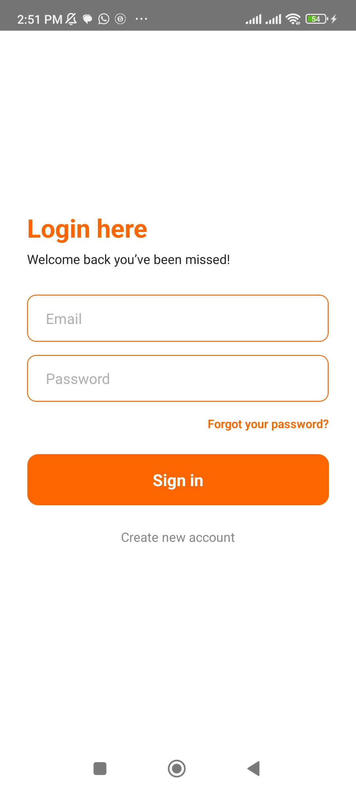
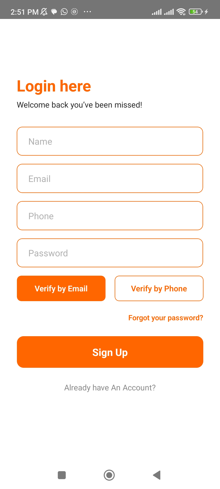
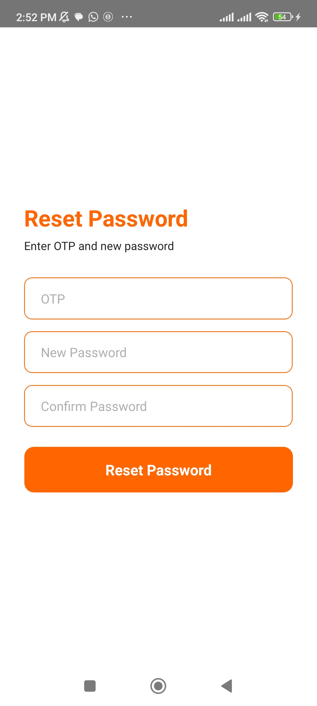
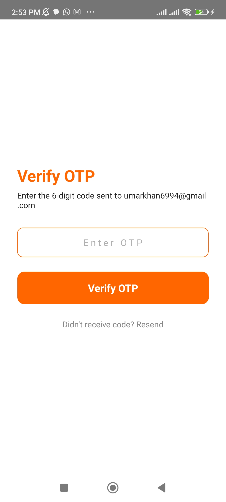
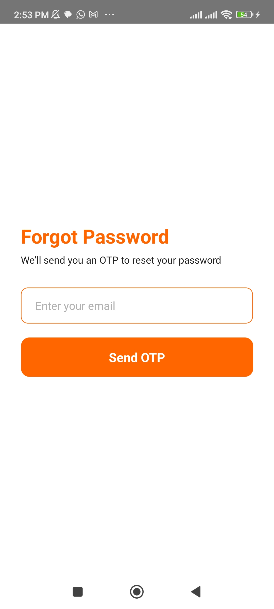
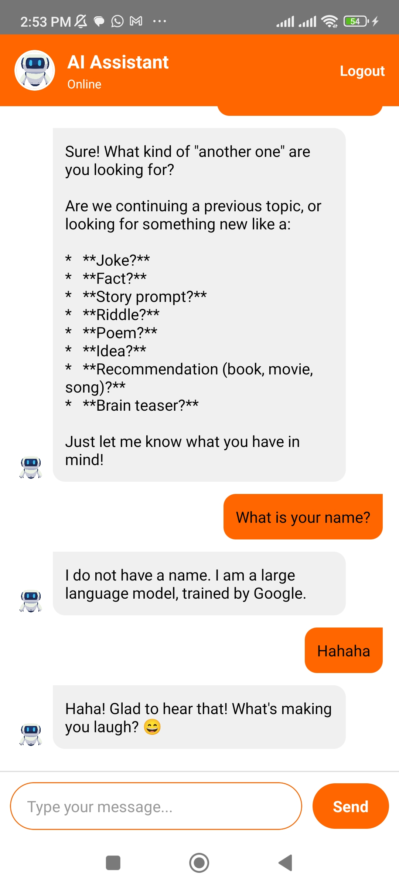

# 🚀 AI Chatbot with User Authentication (Email/Phone OTP + React Query)

This project is a **full-stack AI-powered chatbot application** built with **Node.js, Express, MySQL, Twilio, and Google Gemini API**.
It features a **secure authentication system with OTP verification** (via Email or Phone), password reset functionality, and **real-time chat with an AI assistant**.

---

## ✨ Features

### 🔐 Authentication & Security

* User **registration** with Email/Phone OTP verification
* **Login & Logout** with JWT tokens stored in cookies
* **Forgot & Reset Password** with OTP validation
* Passwords securely hashed using **bcrypt**

### 📩 Verification

* **Email OTP** sent via Nodemailer (custom email templates)
* **Phone OTP** sent via **Twilio SMS/Voice**

### 🤖 AI Chatbot

* **Google Gemini API integration** for intelligent chatbot responses
* Chat history stored in **MySQL database**
* Role-based messages (`user` & `bot`) for structured conversation logs

### 🛠 Tech Stack

* **Backend:** Node.js, Express.js
* **Database:** MySQL
* **Auth:** JWT, bcrypt
* **Messaging APIs:** Nodemailer, Twilio
* **AI API:** Google Gemini API
* **Frontend (planned):** React Native + React Query for API state management

---

## ⚙️ Installation & Setup

### 1️⃣ Clone the Repository

```bash
git clone https://github.com/your-username/ai-chatbot-auth.git
cd ai-chatbot-auth
```

### 2️⃣ Install Dependencies

```bash
npm install
```

### 3️⃣ Configure Environment Variables

Create a `.env` file in the root directory and add the following:

```env
# ========================
# Server Config
# ========================
PORT=5000
NODE_ENV=development

COOKIE_EXPIRE=7

# ========================
# MySQL Database Config
# ========================
DB_HOST=localhost
DB_USER=root
DB_PASSWORD=yourpassword
DB_NAME=aichatbot
DB_PORT=3306

# ========================
# JWT Config
# ========================
JWT_SECRET_KEY=your_secret_key
JWT_EXPIRE=7d

# ========================
# Twilio Config
# ========================
TWILIO_SID=your_twilio_sid
TWILIO_AUTH_TOKEN=your_twilio_auth_token
TWILIO_PHONE_NUMBER=your_twilio_phone

# ========================
# Gemini API
# ========================
GEMINI_API_KEY=your_gemini_api_key

# ========================
# Email Config
# ========================
SMTP_HOST=smtp.gmail.com
SMTP_PORT=587
SMTP_USER=your_email
SMTP_PASS=your_email_password
```

### 4️⃣ Run Server

```bash
npm run dev
```

Server will start at:
👉 `http://localhost:5000`

---

## 📡 API Endpoints

### 🔐 Auth Routes

* `POST /auth/register` → Register user with OTP (email/phone)
* `POST /auth/verify-otp` → Verify OTP and activate account
* `POST /auth/login` → Login with email & password
* `POST /auth/logout` → Logout user
* `POST /auth/forgot-password` → Send OTP for password reset
* `POST /auth/reset-password` → Reset password using OTP

### 🤖 Chat Routes

* `POST /chat/send` → Send user message, get Gemini AI response
* `GET /chat/history` → Retrieve full chat history

---

## 📂 Project Structure

```
backend/
│── config/
│   └── db.js
│── controllers/
│   ├── authController.js
│   └── chatController.js
│── middlewares/
│   ├── error.js
│   └── catchAsyncError.js
│── utils/
│   ├── sendEmail.js
│   ├── sendToken.js
│   ├── emailTemplate.js
│   ├── otpemailTemplate.js
│   └── gemini.js
│── routes/
│   ├── authRoutes.js
│   └── chatRoutes.js
│── server.js
```

---

## 📸 Screenshots

### 🔐 Login & OTP Verification

## 📸 Screenshots  

<p align="center">
  
  
  
  
  
  
</p>


---

## ✅ Future Improvements

* Add **refresh tokens** for improved session handling
* Add **role-based access control (RBAC)** for admin features
* Enable **voice input/output** for chatbot
* Deploy on **Docker + AWS/GCP**

---

## 📜 License

This project is licensed under the **MIT License** – feel free to use and modify it.

---
